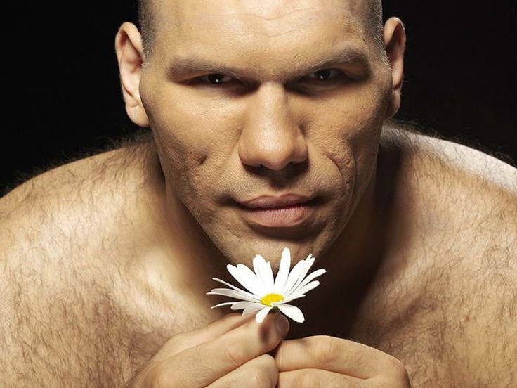

# 👋 Привет, я студент-разработчик!

Добро пожаловать на мой личный сайт. Здесь я делюсь проектами, навыками и мыслями о программировании.




*На фото: я на конференции по программированию, 2025*

---

## 🚀 Что я создаю

### Технологический стек
* 🐍 **Python** — Flask, Django, анализ данных
* 💻 **Веб** — адаптивные интерфейсы, REST API
* 🤖 **ML** — нейросети, обработка естественного языка
* 🗄️ **Базы данных** — PostgreSQL, SQLAlchemy

---

## 📌 Последние обновления

| Дата | Событие  |
|------|----------|
| `2026-02` | Покушал  |
| `2026-01` | Поспал   |
| `2025-12` | Отдохнул |

---

```
«Лучший способ предсказать будущее — создать его самому»  
— Алан Кей
```
